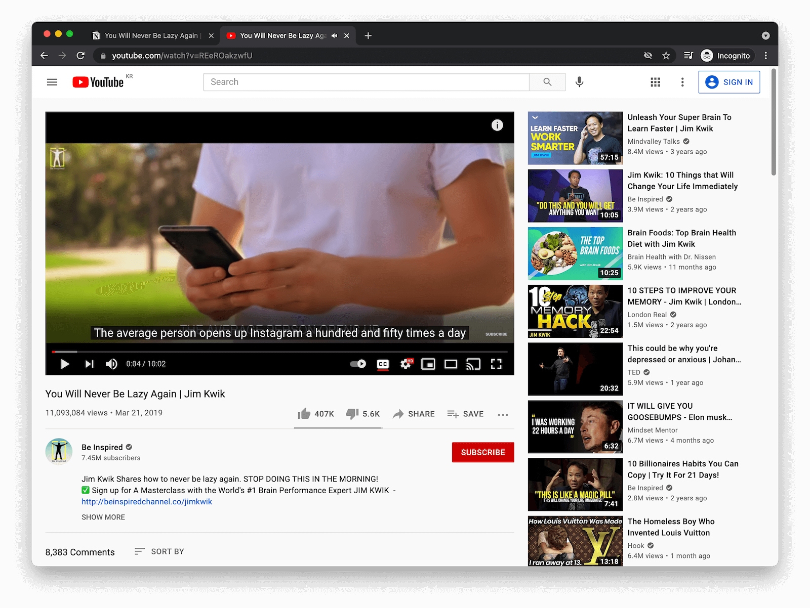
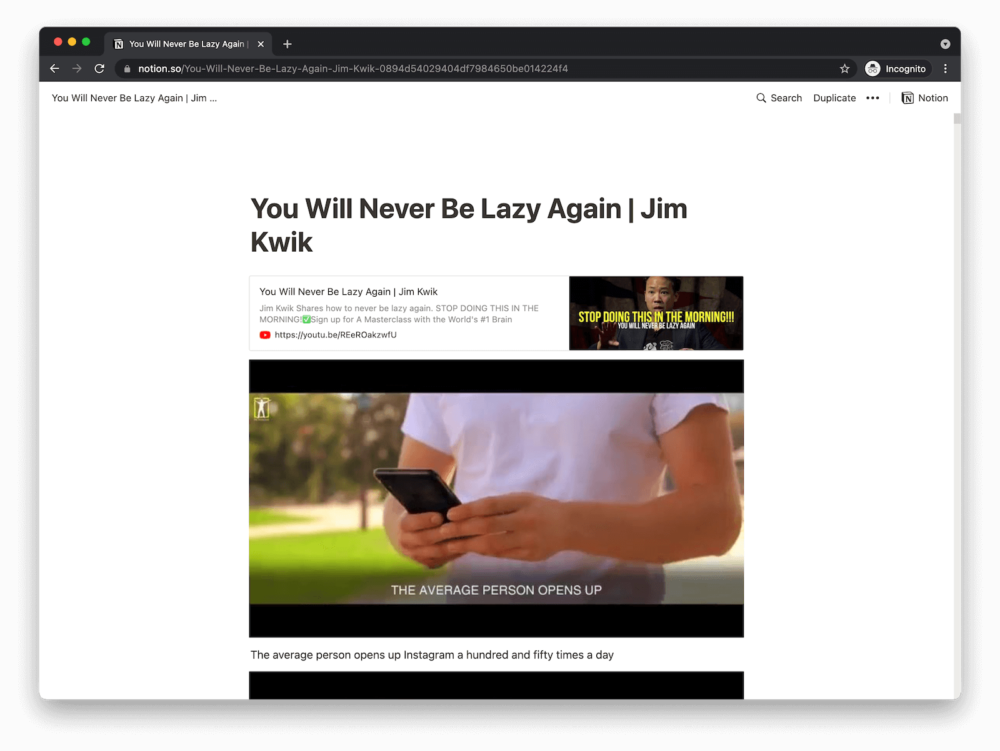

# youtube2notion

> For whom prefers reading than watching

## Example

| YouTube Video                                     | Notion Page                                                                                  |
| ------------------------------------------------- | -------------------------------------------------------------------------------------------- |
|  |                                                |
| https://youtu.be/REeROakzwfU                      | https://www.notion.so/You-Will-Never-Be-Lazy-Again-Jim-Kwik-0894d54029404df7984650be014224f4 |

## How it works

1. Get a youtube video id, a notion token v2, a notion page id by user input
1. Download the youtube video by youtube-dl
1. Split the video into thumbnail images per second by ffmpeg
1. Download the youtube video's subtitle data by youtube_transcript_api
1. Generate a markdown formatted file with the thumbnail images and subtitle
1. Upload the markdown to notion by md2notion

## How to use

### Build

#### Clone the repo

```sh
git clone git@github.com:taehoio/youtube2notion.git
```

#### Build the docker image

```sh
docker build -t taehoio/youtube2notion .
```

### CLI

#### Run CLI

```sh
docker run --rm -it taehoio/youtube2notion youtube2notion.py
```

#### Run CLI with arguments

```sh
docker run --rm -it taehoio/youtube2notion youtube2notion.py YOUTUBE_VIDEO_ID -t NOTION_TOKEN_V2 -p NOTION_PAGE_ID -l TEXT_LANGUAGE
```

### API server

#### Run API server

```sh
docker run --rm -it --name youtube2notion -p 5000:5000 taehoio/youtube2notion app.py
```

#### Call API endpoint

```sh
curl --location --request POST 'http://localhost:5000/upload' \
--header 'Content-Type: application/json' \
--data-raw '{
    "video_id": "YOUTUBE_VIDEO_ID",
    "notion_token_v2": "NOTION_TOKEN_V2",
    "notion_page_url": "NOTION_PAGE_ID",
    "text_language": "TEXT_LANGUAGE"
}'
```
